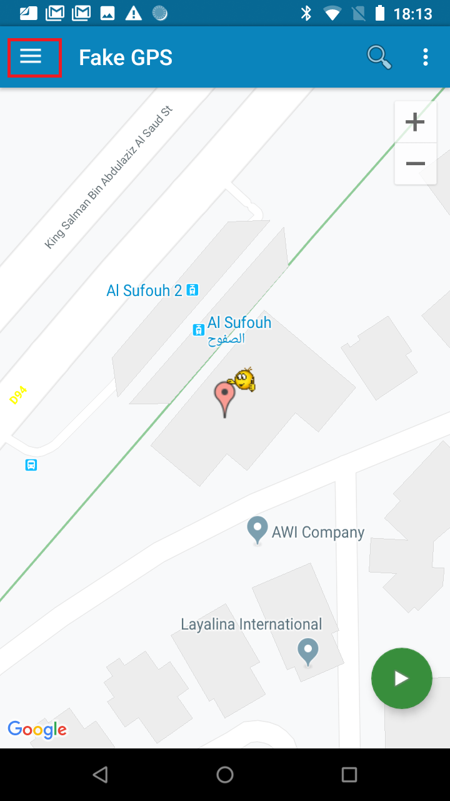

# LocationAware


## System Requirements
   Android Studio 3.4.1 or Higher  [Download From Here](https://developer.android.com/studio) <br>
   Java SE Development Kit 8 or Higher  [Download From Here](https://developer.android.com/studio) <br>
   Physical or Emulated android device of <b>API 23 </b>
   
### Step 1: Create an Account at Here-API Location website <br>

Create a free developer account at the following site [https://developer.here.com/](https://developer.here.com/)) <br>

  <br>

Click on the Generate App ID & App code for the Android Starter Pack Kit

  <br>

In order to generate your unique App ID & App code the Here-API requires the package name of your project
  <br>

Your package name can be found in the AndroidManifest.xml inside your project 

  <br>

Once you've given your package name the website automatically generates your unique App ID & App code <br>
  <br>

### Step 2: Download External Libraries for your project
#### Here Android SDK 
The SDK for Android provides a set of programming interfaces that enable developers to build an immersive, geographically-aware Android applications by leveraging a powerful and flexible mapping platform. Through this SDK, developers can add rich location features such as routing, interactive maps, and global place search to their applications. The powerful client-side SDK for Android also includes a sophisticated engine for rendering map data and calculating routes. In addition to dynamic map data downloads, the SDK also supports offline maps using previously cached map data or downloaded map packages. <br>
[Download Here-Android SDK](https://github.com/jvasvani/LocationAware/blob/master/app/libs/HERE-sdk.aar) <br>

#### Volley Jar File
Volley is an HTTP library that makes networking for Android apps easier and most importantly, faster.

Volley offers the following benefits:

- Automatic scheduling of network requests.
- Multiple concurrent network connections.
- Transparent disk and memory response caching with standard HTTP cache coherence.
- Support for request prioritization.
- Cancellation request API. You can cancel a single request, or you can set blocks or scopes of requests to cancel.

[Download Volley Jar](https://github.com/jvasvani/LocationAware/blob/master/app/libs/volley.jar) <br>

Copy both the external libraries and paste it to the lib folder of your Project Folder <b> YOURPROJECTNAME/App/libs </b>

  <br>


To enable the External Libraries to your project locate module <b>(app-level)</b> Gradle file <b>(usually app/build.gradle)</b>, and add the following lines of code
```groovy
android {
    compileSdkVersion 29
    buildToolsVersion "29.0.0"
    defaultConfig {
        applicationId "com.example.locationaware"
        minSdkVersion 21
        targetSdkVersion 29
        versionCode 1
        versionName "1.0"
        testInstrumentationRunner "androidx.test.runner.AndroidJUnitRunner"
    }
    buildTypes {
        release {
            minifyEnabled false
            proguardFiles getDefaultProguardFile('proguard-android-optimize.txt'), 'proguard-rules.pro'
        }
    }
- Copy the Respositories Function only
   repositories {
         flatDir {
           dirs 'libs'
      }
   }

}
dependencies {
    - Copy all the implemtation methods
    implementation(name: 'HERE-sdk', ext: 'aar')
    implementation 'org.locationtech.jts:jts-core:1.15.0'
    implementation 'com.google.code.gson:gson:2.8.0'
    implementation files('libs/volley.jar')
}


```


###  Step 3: Authenticate your Application <br>
Developers using HERE SDK with their app are required to register for a set of HERE credentials and to specify these credentials (App_Id, App_Code, and licenseKey) in their app's Android manifest XML file. Failure to do so results in blocked access to certain features and degradation in the quality of other services.

Add the meta data to your AndroidManifest.xml file to authenticate your app 

  <br>

```java

<meta-data android:name="com.here.android.maps.appid" android:value="YOUR_APP_ID"/>
<meta-data android:name="com.here.android.maps.apptoken" android:value="YOUR_APP_TOKEN"/>

```

###  Step 4: Update the App Permssion on the AndroidManifest
Every app project must have an AndroidManifest.xml file (with precisely that name) at the root of the project source set. The manifest file describes essential information about your app to the Android build tools, the Android operating system, and Google Play <br>
The permissions that the app needs in order to access protected parts of the system or other apps. It also declares any permissions that other apps must have if they want to access content from this app. Read more about permissions. <br>

  <br>


```java
   <uses-permission android:name="android.permission.WRITE_EXTERNAL_STORAGE" />
    <uses-permission android:name="android.permission.ACCESS_NETWORK_STATE" />
    <uses-permission android:name="android.permission.INTERNET" />
    <uses-permission android:name="android.permission.ACCESS_WIFI_STATE" />
    <uses-permission android:name="android.permission.ACCESS_COARSE_LOCATION"/>
    <uses-permission android:name="android.permission.ACCESS_FINE_LOCATION"/>   
```
Under the <b>application header</b> add the following code
```java
android:hardwareAccelerated="true"
android:largeHeap="true"

```


### Step 5: Update your XML Resource File

From the Android View, under the res/layout/ folder of your project, double-click the activity_main.xml file to open it for editing.

Update your main_activity.xml file with the following code 
```xml
    <LinearLayout
        xmlns:android="http://schemas.android.com/apk/res/android"
        xmlns:tools="http://schemas.android.com/tools"
        android:layout_width="fill_parent"
        android:layout_height="fill_parent"
        android:orientation="vertical"
        tools:ignore="MissingConstraints">


        <fragment
            class="com.here.android.mpa.mapping.MapFragment"
            android:id="@+id/mapfragment"
            android:layout_width="match_parent"
            android:layout_height="match_parent"/>

    </LinearLayout>
```

When SupportMapFragment is initialized, your application's BasicMapActivity contains a SupportMapFragment UI element (with the mapfragment ID) that owns a Map object.

### Step 6: Initialize the Map Fragment

When you have defined the basic layout of the application and acquired necessary permissions, the final step is to initialize the instance of the SupportMapFragment class, thus creating and associating a Map with the SupportMapFragment declared in the <b>activity_main.xml</b> file:

From the Android View double-click the <b>MainActivity.java</b> file under the java folder to open it for editing.


```java

public class MainActivity extends AppCompatActivity {

    private Map map = null;
    private MapFragment mapFragment = null;

    @Override
    protected void onCreate(Bundle savedInstanceState) {
        super.onCreate(savedInstanceState);
        setContentView(R.layout.activity_main);
        mapFragment = (MapFragment) getFragmentManager().findFragmentById(R.id.mapfragment);
        mapFragment.init(new OnEngineInitListener() {
            @Override
            public void onEngineInitializationCompleted(OnEngineInitListener.Error error) {
                if (error == OnEngineInitListener.Error.NONE) {

                    map = mapFragment.getMap();
                    // Map Location of In-5 Knowledge Village
                    map.setCenter(new GeoCoordinate(25.107877, 55.165201, 0.0), Map.Animation.NONE);
                    map.setZoomLevel(18);


                }
            }
        });
    }

}

```
### Run the Applciation
You can now run your simple application.The application renders a map retrieved from the HERE servers. When you are running your application on a device, make sure data connection is enabled.

### Step 7: Getting your Real-Time Locataion on your App 

Before you get your real-time location on you app make sure you have enabled Location for your App 

Go to Settings on your Android Device > Select <b>Apps & Notifications </b>

  <br>

Select your Debugging App <b> Geolocation </b>
   
  <br>

Select <b> Permission </b>

  <br>

.. Enable the <b> Location & Storage Space </b>

  <br>

Next Step, we have to inialize the following variable under our MainActivity.java class
```java
    private PositioningManager positioningManager = null;
    private PositioningManager.OnPositionChangedListener positionListener;
    private GeoCoordinate currentPosition;
    private GeoCoordinate oldPosition;

```

We now need to define a function inside the <b> OnEngineInitListener </b> which  runs on a continues loop to track your current location 

```java

                   positioningManager = PositioningManager.getInstance();
                    positionListener = new PositioningManager.OnPositionChangedListener() {

                        @Override
                        public void onPositionUpdated(PositioningManager.LocationMethod method, GeoPosition position, boolean isMapMatched) {
                            currentPosition = position.getCoordinate();
                            if(!currentPosition.equals(oldPosition)) {
                              // Step 10 : Function Called HERE - Not Made yet 
                                map.setCenter(position.getCoordinate(), Map.Animation.NONE);
                                oldPosition = currentPosition;
                            }
                        }
                        @Override
                        public void onPositionFixChanged(PositioningManager.LocationMethod method, PositioningManager.LocationStatus status) { }
                    };
                    try {
                        positioningManager.addListener(new WeakReference<>(positionListener));
                        if(!positioningManager.start(PositioningManager.LocationMethod.GPS_NETWORK)) {
                            Log.e("HERE", "PositioningManager.start: Failed to start...");
                        }
                    } catch (Exception e) {
                        Log.e("HERE", "Caught: " + e.getMessage());
                    }
                    map.getPositionIndicator().setVisible(true);

```
### Step 8: Creating your own Polygons on the Map  

  <br>

A polygon on the earth's surface. A polygon can be convex or concave, it may span the 180 meridian and it can have holes that are not filled in. It has the following properties:

- Holes
A hole is a region inside the polygon that is not filled. A hole is specified in exactly the same way as the outline. A hole must be fully contained within the outline. Multiple holes can be specified, however overlapping holes are not supported.

  <br>

- Fill Color
Fill color in ARGB format, the same format used by Color. The default value is transparent (0x00000000). If the polygon geometry is not specified correctly (see above for Outline and Holes), then no fill will be drawn.


  <br>

```java
 List<GeoCoordinate> in5_kv = new ArrayList<GeoCoordinate>();


                    in5_kv.add(new GeoCoordinate(25.107785, 55.165478, 0.0));
                    in5_kv.add(new GeoCoordinate(25.108073, 55.165254, 0.0));
                    in5_kv.add(new GeoCoordinate(25.107751, 55.164961, 0.0));
                    in5_kv.add(new GeoCoordinate(25.107561, 55.165163, 0.0));

                    GeoPolygon polygon = new GeoPolygon(in5_kv);
                    MapPolygon mapPolygon = new MapPolygon(polygon);
                    mapPolygon.setFillColor(Color.argb(70, 0, 255, 0));
                    map.addMapObject(mapPolygon);

```

### Step 9: Uploading GeoFence Data to HERE with HTTP 

To save the client from having to do a lot of number crunching, geofence position detection is handled server side from the HERE servers. Essentially we upload fence data and then we send our position every time we want to check the proximity to a fence. Remember, we could have potentially thousands of fences, so doing this client side would not be a good idea.
```cmd -black 
POLYGON ((55.165478 25.107785,55.165254 25.108073,55.164961 25.107751,55.165163 25.107561,55.165478 25.107785))
```

The above POLYGON data represents the In-5 Block Knowledge Village Area. While the data is correctly formatted, it isn’t quite ready to be sent to the HERE servers. Instead, it has to be added to a tab delimited file like the following:

```cmd 
NAME    WKT
KV POLYGON ((55.165478 25.107785,55.165254 25.108073,55.164961 25.107751,55.165163 25.107561,55.165478 25.107785))
```
It is very important that the file is tab delimited and those are actual tabs, not spaces representing tabs. The NAME column represents the name of the particular fence. For example it could be a store id value or whatever else you can think up. The WKT column represents the actual geofence.

Give the file a name with a .wkt extension and add it to a ZIP archive. The file must exist at the root of the ZIP archive.

Per the [HERE Geofencing API documentation](https://developer.here.com/documentation/geofencing/topics/example-layer-upload.html) , the fence data can be uploaded with the following cURL command:
``` cmd
curl --request -i -X POST -H "Content-Type: multipart/form-data" -F "zipfile=@C:\Users\YOURUSERNAME\Desktop\polydata.zip" "https://gfe.api.here.com/2/layers/upload.json?layer_id=4711&app_id={YOUR_APP_ID}&app_code={YOUR_APP_CODE}"
```

Take note of the layer_id and make sure you provide your own app id and app code values. You can have numerous layers, representing different groups of geofencing data, so it is important to reference the correct layer_id in the Android project.

  <br>


### Step 10: Checking the Proximity of a Geofence with HTTP in Android 
As of now we’ve created and uploaded our geofence and configured our Android application to listen for changes in position. We have to see if our position is within a geofence that we’ve uploaded.

To do this, we’ll need to make use of HTTP requests within Android. When the position changes, we’ll need to send that position to the HERE server along with the layer_id for our possible geofences. If there is a match, we’ll see such in the result and be able to do a push notification or similar to the user.

There are numerous ways to do HTTP requests in Android, but the easiest is with Volley.
Within the project, add the <b> makeRequest </b> method to the <b>MainActivity class</b>
Make sure you update your App code & App ID in the Request url method 
```java
    public void makeRequest(GeoCoordinate coords) {
        RequestQueue queue = Volley.newRequestQueue(this);
        final String code;
        Log.d("Debug", "MakeRequest");
        print("Coordinates: "+coords);
        JsonObjectRequest request = new JsonObjectRequest(Request.Method.GET,"https://gfe.api.here.com/2/search/proximity.json?layer_ids=4711&app_id=14tVYqHaHTOGwQTUno2z&app_code=xTSD3c7c3rkh1MjUNMnZtg&proximity=" + coords.getLatitude() + "," + coords.getLongitude() + "&key_attribute=NAME", null, new com.android.volley.Response.Listener<JSONObject>() {
            @Override
            public void onResponse(JSONObject response) {
                try {
                    Log.d("tag", "OnResponseCalled");
                    JSONArray geometries = response.getJSONArray("geometries");
                    if(geometries.length() >0 ){
                    if(geometries.getJSONObject(0).getJSONObject("attributes").getString("NAME").equals("KV")){
                        Log.d("tag", "Welcome to Knowledge Village");
                        String code1 = "A" ;
                        Notification(code1);

                    } 

                                        }
                    else{
                         String code1 = "Unknown" ;
                          Notification(code1);
                        Log.d("tag", "Outside Area");
                    }
                } catch (Exception e) {
                    e.printStackTrace();
                }
            }
        }, new com.android.volley.Response.ErrorListener() {
            @Override
            public void onErrorResponse(VolleyError error) {
                Log.d("HERE", error.getMessage());
            }
        });
        queue.add(request);
    }


```
### Step 11: Sending a Notification to Alert the User 
We are going to create function named <b> Notification </b> which displays a Toast messsage only if our current location is present with the geofence data provided to the HERE servers.
```java

    public void  Notification( String locationcode) {

        Log.d("Debug", "Notification");

        if(locationcode == "A"){
            Toast.makeText(this,"Welcome To IN- 5", Toast.LENGTH_LONG).show();
        }
        else if(locationcode == "B"){
            Toast.makeText(this,"Welcome To Location B", Toast.LENGTH_LONG).show();
        }
        else if(locationcode == "C"){
            Toast.makeText(this,"Welcome To Location C", Toast.LENGTH_LONG).show();
        }
        else if (locationcode == "Unknown"){
            Toast.makeText(this,"Unspecified Location Area", Toast.LENGTH_LONG).show();
        }

    }

```

### Step 12: Mocking you device location (Physical Android Device)
First, head to the Play Store and search for Fake GPS location app. 
  <br>


Next, if you haven’t already done so, [Enable Developer Options](https://www.greenbot.com/article/2457986/how-to-enable-developer-options-on-your-android-phone-or-tablet.html) on your phone. To do this, jump into your settings menu by pulling down the notification shade and tapping on the gear icon. From there, scroll down to the bottom of the list and select the System option.

Now that you’re inside the Developer options menu, first make sure the toggle at the top of the list is turned on. Next, locate the Select mock location app option. Choose Fake GPS location app

  <br>

Next, Open the Fake Location App and Select the <b> Side Navigator Bar </b>
  <br>


Enter the Cordinates of the location you want to mock
- Dubai Design District
<b>25.184272, 55.295134 </b>

- Dowtown Dubai 
<b>25.194012, 55.267126 </b>

  <br>

You might want to re-upload your .mkt file to there HERE Server with above two locations cordinates 
```cmd
NAME	WKT
KV	POLYGON ((55.165478 25.107785,55.165254 25.108073,55.164961 25.107751,55.165163 25.107561,55.165478 25.107785))
DDD	POLYGON((55.295134 25.184272,55.294489 25.199339,55.308610 25.200621,55.309840 25.182189,55.295134 25.184272))
DD	POLYGON((55.267126 25.194012,55.272255 25.202846,55.289192 25.194044,55.277694 25.185237,55.267126 25.194012))
```

#### Polygon Data for the remaining Area
```java

     // Dubai Downtown Dubai 
              //>>>>>>>>>> Downtown Dubai
                    // Area : B
                    List<GeoCoordinate> downtown_d = new ArrayList<GeoCoordinate>();
                    downtown_d.add(new GeoCoordinate(25.194012, 55.267126, 0.0));
                    downtown_d.add(new GeoCoordinate(25.202846, 55.272255, 0.0));
                    downtown_d.add(new GeoCoordinate(25.194044, 55.289192, 0.0));
                    downtown_d.add(new GeoCoordinate(25.185237, 55.277694, 0.0));

                    GeoPolygon geoDowntownPolygon = new GeoPolygon(downtown_d);
                    MapPolygon mapDowtownPolygon = new MapPolygon(geoDowntownPolygon);
                    mapDowtownPolygon.setFillColor(Color.argb(70, 255, 0, 0));
                    map.addMapObject(mapDowtownPolygon);


       //Dubai Design District 

       List<GeoCoordinate> design_district = new ArrayList<GeoCoordinate>();
                    design_district.add(new GeoCoordinate(25.184272, 55.295134, 0.0));
                    design_district.add(new GeoCoordinate(25.199339, 55.294489, 0.0));
                    design_district.add(new GeoCoordinate(25.200621, 55.308610, 0.0));
                    design_district.add(new GeoCoordinate(25.182189, 55.309840, 0.0));

                    GeoPolygon polygon_design_district = new GeoPolygon(design_district);
                    MapPolygon mapPolygon_design = new MapPolygon(polygon_design_district);
                    mapPolygon_design.setFillColor(Color.argb(70, 0, 0, 255));
                    map.addMapObject(mapPolygon_design);


```
Make sure you zip file and upload the data as seen on <b> Step 9 </b>

Update the changes in the <b> makeRequest </b> function 
```java
 public void makeRequest(GeoCoordinate coords) {
        RequestQueue queue = Volley.newRequestQueue(this);
        final String code;
        Log.d("Debug", "MakeRequest");
        print("Coordinates: "+coords);
        JsonObjectRequest request = new JsonObjectRequest(Request.Method.GET,"https://gfe.api.here.com/2/search/proximity.json?layer_ids=4711&app_id=14tVYqHaHTOGwQTUno2z&app_code=xTSD3c7c3rkh1MjUNMnZtg&proximity=" + coords.getLatitude() + "," + coords.getLongitude() + "&key_attribute=NAME", null, new com.android.volley.Response.Listener<JSONObject>() {
            @Override
            public void onResponse(JSONObject response) {
                try {
                    Log.d("tag", "OnResponseCalled");
                    JSONArray geometries = response.getJSONArray("geometries");
                    if(geometries.length() >0 ){
                    if(geometries.getJSONObject(0).getJSONObject("attributes").getString("NAME").equals("KV")){
                        Log.d("tag", "Welcome to Knowledge Village");
                        String code1 = "A" ;
                        Notification(code1);

                    } else if (geometries.getJSONObject(0).getJSONObject("attributes").getString("NAME").equals("DD")){
                        Log.d("HERE", "Welcome To Dubai Downtown.");
                        String code1 = "B" ;
                        Notification(code1);
                     }

                      else if (geometries.getJSONObject(0).getJSONObject("attributes").getString("NAME").equals("DDD")){
                        Log.d("HERE", "Welcome To Dubai Design District.");
                        String code1 = "C" ;
                        Notification(code1);
                     }


                    }
                    else{
                         String code1 = "Unknown" ;
                          Notification(code1);
                        Log.d("tag", "Outside Area");
                    }
                } catch (Exception e) {
                    e.printStackTrace();
                }
            }
        }, new com.android.volley.Response.ErrorListener() {
            @Override
            public void onErrorResponse(VolleyError error) {
                Log.d("HERE", error.getMessage());
            }
        });
        queue.add(request);
    }
```
### Step 12: Mocking you device location (Emulator Device)

In case you do not have a physical android device to test the application, use the AVD manager to create an emulator with a minimum API version 23. Then run the application on the emulator. Make sure you follow the step 7 i.e. enable location services for the app in the emulator. 
